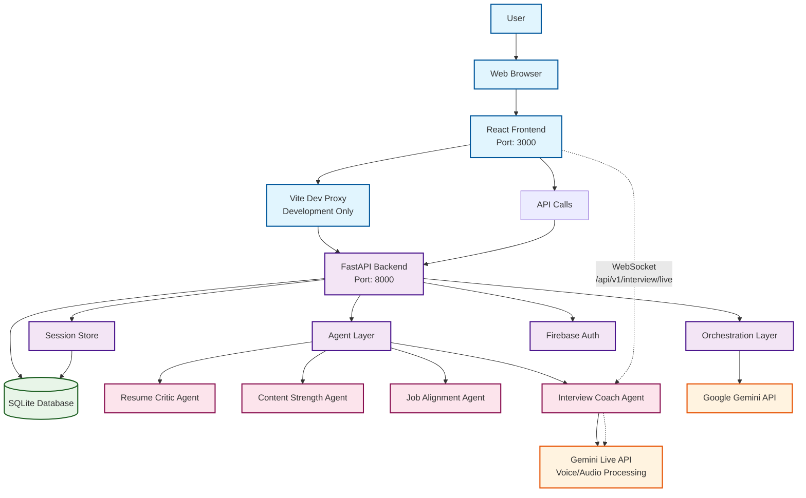
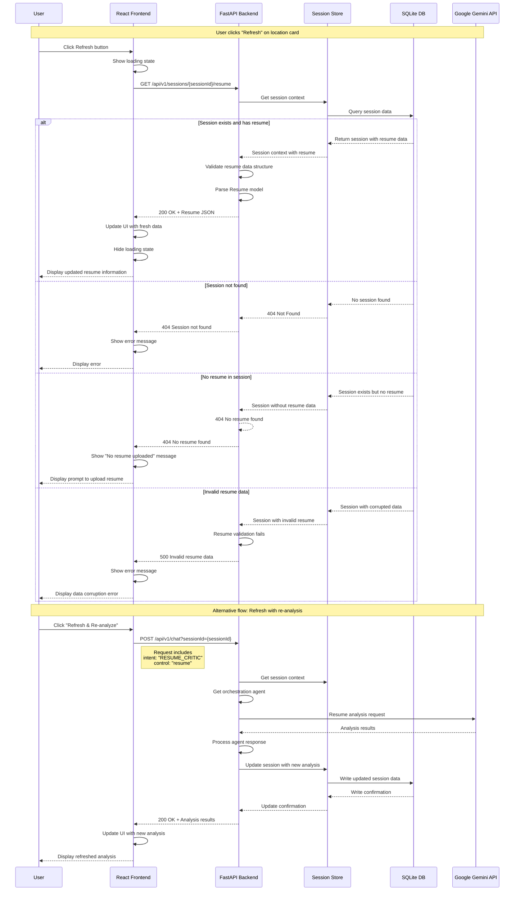

# Architecture

This document provides a comprehensive overview of the InterviewReady system architecture, including the snapshot pattern, frontend-backend proxy setup, and external API integrations.

## System Overview

InterviewReady follows a microservices architecture with clear separation of concerns across multiple layers. The system is designed for scalability, maintainability, and real-time performance.

## System Architecture



## Architecture Layers

### Frontend Layer
- **React 19**: Modern React with concurrent features
- **TypeScript**: Type-safe development
- **Vite**: Fast development server with proxy configuration
- **Port 3000**: Development server port
- **WebSocket Client**: Real-time communication for voice interviews

### Backend Layer
- **FastAPI**: High-performance async web framework
- **Port 8000**: Main API server port
- **CORS Configuration**: Cross-origin resource sharing setup
- **Rate Limiting**: Request throttling and abuse prevention
- **Middleware**: Request logging, size validation, and error handling

### Orchestration Layer
- **Agent Selection**: Intelligent routing to appropriate specialized agents
- **Session Management**: Context persistence and state management
- **Workflow Coordination**: Multi-step process orchestration
- **Error Handling**: Graceful failure recovery and fallbacks

### Agent Layer
- **Resume Critic Agent**: ATS optimization and structure analysis
- **Content Strength Agent**: Content quality and impact assessment
- **Job Alignment Agent**: Job description matching and scoring
- **Interview Coach Agent**: Live voice interview coaching

### Persistence Layer
- **SQLite Database**: Lightweight, file-based database
- **Session Store**: In-memory caching with persistence
- **Data Models**: Pydantic-based schema validation

### External Integration Layer
- **Google Gemini API**: Text generation and analysis
- **Gemini Live API**: Real-time voice processing
- **Firebase Authentication**: User management and security

## Snapshot Pattern

The system implements a snapshot pattern for state management and data persistence:

### Session Snapshots
- **Checkpoint Creation**: Automatic snapshots at key decision points
- **State Restoration**: Ability to rewind to previous states
- **Incremental Updates**: Only store changes between snapshots
- **Compression**: Efficient storage of session data

### Data Flow
1. **Initial State**: Session creation with empty snapshot
2. **User Interaction**: Each action creates a new checkpoint
3. **Agent Processing**: Results stored as incremental updates
4. **Snapshot Merge**: Periodic consolidation of changes
5. **Persistence**: Final state written to database

### Benefits
- **Performance**: Fast state restoration without reprocessing
- **Reliability**: Recovery from failures at any point
- **Debugging**: Complete audit trail of user interactions
- **Flexibility**: Support for undo/redo operations

## Frontend-Backend Proxy Setup

### Development Environment
During development, Vite provides a proxy configuration to handle CORS and API routing:

```typescript
// vite.config.ts
export default defineConfig({
  server: {
    port: 3000,
    host: '0.0.0.0',
  },
  // Vite proxy handles API requests to backend
  // Frontend: http://localhost:3000
  // Backend: http://localhost:8000
});
```

### Production Environment
In production, the frontend and backend are deployed separately:
- **Frontend**: Cloud Run service with static hosting
- **Backend**: Cloud Run service with API endpoints
- **CORS**: Explicit allowlist for production domains
- **WebSocket**: Direct connection to interview endpoint

### API Communication
- **REST Endpoints**: Standard HTTP requests for most operations
- **WebSocket**: Real-time communication for voice interviews
- **Authentication**: Session-based authentication with user context
- **Error Handling**: Consistent error responses across all endpoints

## External API Integration

### Google Gemini Integration
- **Text Generation**: Resume analysis and content creation
- **Model Selection**: Gemini Pro for text, Gemini Live for voice
- **Rate Limiting**: API quota management and throttling
- **Error Handling**: Graceful degradation on API failures

### Firebase Integration
- **User Authentication**: Token-based user management
- **Session Security**: Secure session handling
- **Permission Control**: Access control for user data

## Data Flow: Refresh Operation

The following sequence diagram shows what happens when a user clicks "Refresh" on a location card:



## Technology Stack Details

### Backend Technologies
- **FastAPI 0.104+**: Modern async web framework
- **Python 3.11+**: Latest Python with async/await
- **SQLAlchemy 2.0+**: Async ORM with modern patterns
- **Pydantic 2.0+**: Data validation and serialization
- **LangChain**: AI agent orchestration framework
- **LangGraph**: Agent workflow management

### Frontend Technologies
- **React 19**: Latest React with concurrent features
- **TypeScript**: Type-safe JavaScript development
- **Vite 6.0+**: Fast build tool and dev server
- **Zod**: Runtime type validation
- **TailwindCSS**: Utility-first CSS framework

### Infrastructure
- **Google Cloud Run**: Serverless container platform
- **Docker**: Containerization for deployment
- **SQLite**: Lightweight embedded database
- **WebSocket**: Real-time communication protocol

## Security Considerations

### Authentication & Authorization
- **Session-based Authentication**: Secure session management
- **CORS Configuration**: Proper cross-origin setup
- **Rate Limiting**: API abuse prevention
- **Input Validation**: Comprehensive request validation

### Data Protection
- **Encryption**: Data in transit encryption
- **Sanitization**: Input sanitization and validation
- **Audit Logging**: Complete audit trail
- **Error Handling**: Secure error responses

## Performance Optimizations

### Backend Optimizations
- **Async Processing**: Non-blocking I/O operations
- **Connection Pooling**: Database connection management
- **Caching**: In-memory session caching
- **Batch Processing**: Efficient bulk operations

### Frontend Optimizations
- **Code Splitting**: Lazy loading of components
- **Bundle Optimization**: Minimized JavaScript bundles
- **Caching Strategy**: Browser caching optimization
- **WebSocket Optimization**: Efficient real-time communication

## Scalability Considerations

### Horizontal Scaling
- **Stateless Design**: Easy horizontal scaling
- **Load Balancing**: Multiple instance support
- **Database Sharding**: Data partitioning strategy
- **Caching Layer**: Redis integration potential

### Vertical Scaling
- **Resource Allocation**: Dynamic resource management
- **Performance Monitoring**: Real-time metrics
- **Auto-scaling**: Cloud Run automatic scaling
- **Cost Optimization**: Efficient resource usage

## Monitoring & Observability

### Application Monitoring
- **Health Checks**: System status monitoring
- **Performance Metrics**: Request/response times
- **Error Tracking**: Comprehensive error logging
- **Usage Analytics**: User behavior tracking

### AI/ML Observability
- **Langfuse Integration**: AI model monitoring
- **Agent Performance**: Individual agent metrics
- **Model Drift**: AI performance degradation detection
- **Cost Tracking**: API usage monitoring

This architecture provides a robust, scalable foundation for the InterviewReady platform, enabling real-time AI-powered interview coaching while maintaining high performance and reliability.
